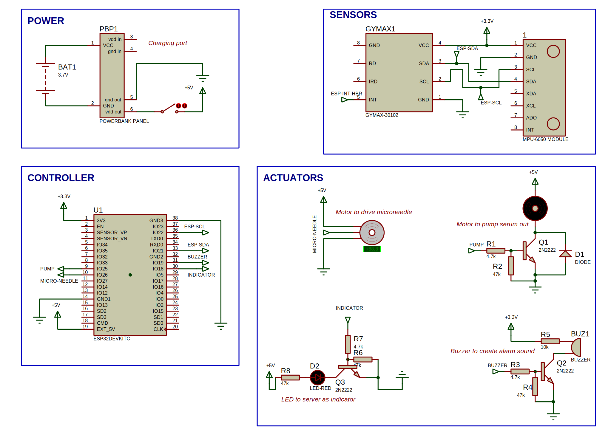

# anti-epilepsy
A device with &lt; 10ms response time to epilepsy seizure and automated aministration of antidote via microneedles. Juts a model though :)

Project Timeline: [https://hackmd.io/@VicTheM/Sk5LHTkKee](https://hackmd.io/@VicTheM/Sk5LHTkKee)
--

## Contents
1. [Introduction](#intoduction)
2. [System Overview](#system-overview)  
3. [Hardware Design](#hardware-design)  
4. [Software Architecture](#software-architecture)  
5. [Usage Instructions](#usage-instructions)  
6. [Testing & Results](#testing--results)  
7. [Future Work](#future-work)  
8. [References](#references)

### Introduction

> [!NOTE]
> This is an embedded project, using latest technology trends (as at August 2025) around microneedles to tackle a global problem faced by individuals who get epilepsy seizures and require immediate medical intervention.

***TL;DR: A BRIEF ON HOW IT WORKS***

This device is typically attached to the bicep of a patient to monitor, while all is good with the person in question the device remains in an idle mode,but immediately an epilepsy seizure is detected, antidotes are pumped from a mini-storage unit unto the person's skin, then a microneedle is used to stamp this antidote into the person's bloodstream without trace or pain. while the antidote is being administered, an alarm will keep sounding in order to aleart for help form anybody that may be nearby.

***LONGER INTRODUCTION***

There are 4 steps to the operation of this device 
1. Detect an epilepsy seizure
2. Administer the antidote very quickly (<3secs)
3. Trigger an alarm for medical assistance
4. Return to standby mode

As you might have imagined, this device has to be portable and mobile - Yes it is. powered by a 9000mAh lightweight lithium battery, effectively allowing for up to 8 hours of continuous operation, this device can be strapped to the patient's body (specifically the biceps) for long periods of time, even during a nap.

As a summary, this is a portable anti-epilepsy device that helps individuals experiencing seizures by providing immediate intervention and support.

### System Overview

Subsystems were designed to achieve the four state of operation as listed above, let's have a go over them:

- ***Power Management***: version one is currently running on a 2x 3.7V 4500mAh lithium polymer battery, boosted by a 5V powerbank panel to supply to the 5v rail and brought down to 3.3v by a linear regulator to supply low voltage sensors power, driving our power capacity to a whooping 33W. Standby mode power consumption is < 1W and during antidote administration, the device consumes a peak power of 4W but for only 3secs, hence we can achieve 8 hours of continuous operation with more than 20 seizures handled during this time.
-  ***Seizure Detection Module***: Utilizes advanced sensors and algorithms to accurately detect the onset of a seizure. This module is composed of several sensors fused together:

    - **IMU Unit**: Inertial Measurement Unit (IMU) combines accelerometer and gyroscope data to detect abnormal body movements associated with seizures. The algorithm and software filter used is greatly tunned to beat down false trigger to < 1%. To study the implementation of this algorithm, please refer to the source code
    - **HeartBeat Rate Sensor**: The IMU also is not sufficient to accurately detect a seizure with precision, hence I added another layer of validation using an infrared heartbeat rate sensor, since blood pressure increases during seizures. The major challenge with the sensor is its noise ratio, so I built different dedicated statistical filters such that data from this sensor passes through several stages of validation before being fused with the other sensor data for a holistic inference
- **Drug Delivery System**: Employs microneedle technology for rapid and painless administration of the antidote. This subsystem consist of the following:

    - **Tank**: This is a basic-mini compartment to hold the antidote, it is air tight and the fluid can only come out through a pipe when pumped
    - **Pressure system**: This consist of the pipe and pump using to move the antidote from the compartment to the patient's skin
    - **Microneedle**: The microneedle is driven by a geared-linear actuator (servo motor) and it stamps the antidote into the skin with high torque and low speed to avoid pain and other negative possibilities.
- **Communication Interface**: Connects to a mobile app for real-time monitoring and alerts.

